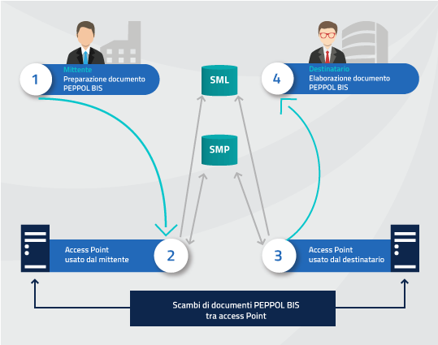
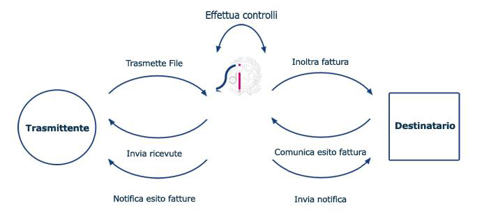
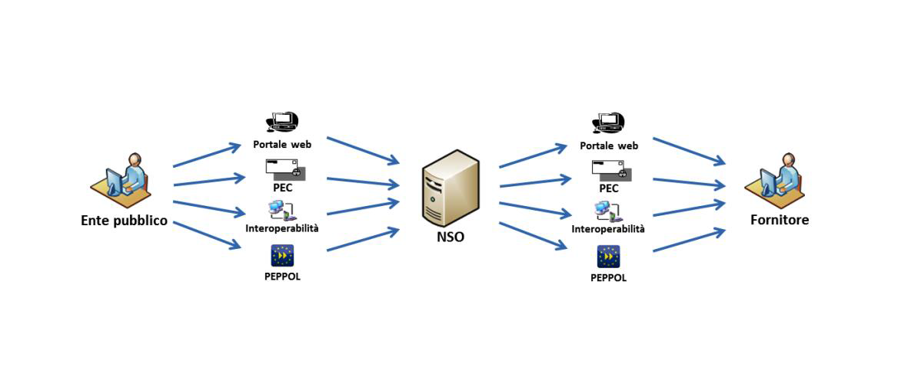

== Premessa
(((2. Premessa)))

Nell'ambito degli obblighi formativi footnote:[Legge Regionale n.11 del 05/2004 e successiva Legge Regionale 17/2013]
 in materia di _fatturazione elettronica_ e digitalizzazione dei processi,
la regione Emilia Romagna ha istituito il *SiCiPa-ER* footnote:[Sistema regionale per la dematerializzazione del ciclo passivo] in capo ad Intercent-ER, da utilizzare per l'emissione,
la trasmissione, il ricevimento, la conservazione e l'archiviazione dei documenti in forma elettronica.

In questo ambito è stato realizzato il *Nodo telematico di Interscambio Regione Emilia-Romagna (NoTI-ER)*,
che costituisce lo strumento organizzativo interoperabile per la gestione dei documenti di e-Procurement. +
La piattaforma nasce con il requisito cardine di assicurare l'inoltro ed il ricevimento di documenti validati
e conformi alle regole tecniche europee e statali.

Pertanto, NoTI-ER adotta il formato *UBL* footnote:[http://docs.oasis-open.org/ubl/]
per la rappresentazione dei Documenti di e- Procurement e include un *Access Point Peppol* per integrarsi con l’infrastruttura di trasporto BusDox
prevista nell’ambito del progetto europeo *Peppol* footnote:[http://www.peppol.eu], al fine di gestire e veicolare lo scambio
 degli stessi tra i fornitori e la Pubblica Amministrazione. +
Come descritto in _figura 1_, Peppol si basa sull'utilizzo di un modello denominato
_4-corners_, attraverso il quale avviene lo scambio di documentazione elettronica
tra le parti coinvolte. +
In questo contesto, NoTI-ER (più precisamente, il suo Access Point) svolge la funzione
di secondo o terzo corner, a seconda di quale sia l'indirizzamento del flusso documentale
in atto.

Inoltre, con l'approvazione di uno specifico decreto del Ministero dell'Economia e Finanze
footnote:[DM 55 del 04/2013],
è stato definito il regolamento che le Pubbliche Amministrazioni Locali devono adottare
in materia di emissione, trasmissione e ricevimento della *fattura elettronica*.
In particolare:

* il formato da utilizzare, ossia _FatturaPA_;
* l'integrazione con il _Sistema di Interscambio_ nelle modalità di trasmissione,
ricezione e colloquio (_Figura 2_).

.Inquadramento del Sistema di Interscambio

Con l'entrata in vigore del suddetto decreto, si è resa evidente la necessità
di accreditare NoTI-ER come Intermediario presso SdI, ma anche di realizzare
la logica necessaria all'integrazione con i relativi servizi di trasmissione e
ricezione e di supportare le varie fasi del _flusso dei messaggi_ entro i termini
previsti dalla prima scadenza.

Parallelamente, ai sensi di un altro, più recente, decreto ministeriale
footnote:[DM del 7 dicembre 2018], è stato stabilito l'obbligo per gli Enti
del _Sistema Sanitario Nazionale_ di emettere *ordini d'acquisto* in formato
elettronico e di trasmetterli per il tramite del *Nodo Smistamento Ordini (NSO)*.

.Inquadramento del Nodo Smistamento Ordini

Il formato dei documenti accettati da NSO e i processi attraverso i quali avviene lo scambio
degli stessi risultano compatibili con l'utilizzo di Peppol.
Pertanto, dal punto di vista degli utenti di NoTI-ER, l'invio e la ricezione dei documenti
verso e da NSO avviene utilizzando questa infrastruttura.

La fase di *conservazione* della documentazione elettronica è, invece, realizzata tramite l’integrazione di NoTI-ER
con il Sistema di Conservazione, messo a disposizione da *ParER*,
secondo lo schema (*SacER*) previsto dalle relative specifiche di servizio.
